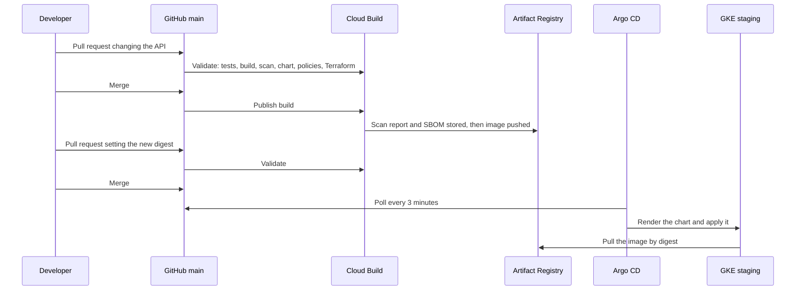
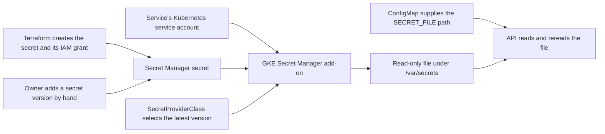
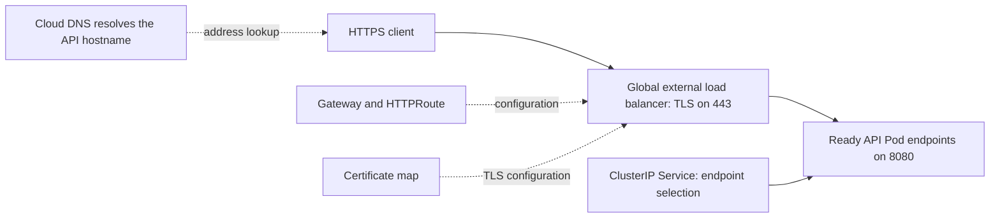

# Guide

This guide explains every part of this repository: what each component does, how it is configured, and why it is built this way. Each component section has four parts: **What it does**, **How it is configured**, **Why**, and **Other options**, which links to approaches I did not take. File names link to the source that implements them.

The [README](README.md) describes the platform and its results, the [runbook](RUNBOOK.md) holds the procedures and commands, and [architecture.md](architecture.md) states the requirements. The [evidence reports](platform/evidence/README.md) record what each part did in a real lab session.

## Contents

- [The platform on one page](#the-platform-on-one-page)
- [Why a lab, and how it is configured](#why-a-lab-and-how-it-is-configured)
- [Terraform and the Google Cloud foundation](#terraform-and-the-google-cloud-foundation)
- [Network and GKE](#network-and-gke)
- [The application and its container](#the-application-and-its-container)
- [The shared Helm chart](#the-shared-helm-chart)
- [The image pipeline](#the-image-pipeline)
- [GitOps with Argo CD](#gitops-with-argo-cd)
- [Isolation, identity, and secrets](#isolation-identity-and-secrets)
- [Admission with Kyverno](#admission-with-kyverno)
- [HTTPS: DNS, certificate, and Gateway](#https-dns-certificate-and-gateway)
- [Observability and alerts](#observability-and-alerts)
- [Validation and evidence](#validation-and-evidence)
- [Costs](#costs)
- [Results and limitations](#results-and-limitations)

## The platform on one page

### What it does

A developer ships a service by merging pull requests and never touches the cluster. One pull request changes the application; the pipeline tests it, builds and scans its image, and publishes it. Another pull request changes one image digest in the service's values file; Argo CD deploys exactly that image to GKE, where admission policies, network policies, and workload identity apply the platform's rules. Reverting to an earlier digest rolls back without a rebuild.

Building an image and deploying it are separate decisions: Cloud Build makes an image available, a pull request selects its digest in Git, and Argo CD makes the cluster match Git.

### Who owns what

Every resource and decision has exactly one owner, so two systems never keep replacing each other's changes.

| Owner | Owns |
| --- | --- |
| Terraform | APIs, network, cluster and node pool, image and mirror repositories, service accounts and IAM, secrets without their values, build triggers and evidence bucket, DNS zone and certificate, the lab's static IP and DNS record, alert policies |
| Argo CD | Everything inside the cluster after the bootstrap: the `staging` namespace and its guardrails, the admission policies, Kyverno itself, the Gateway, and each service's resources |
| GKE's own controllers | The cloud resources they generate from Kubernetes objects, such as the load balancer behind the Gateway |
| The HorizontalPodAutoscaler | Each service's replica count, within its bounds |
| The cluster autoscaler | The node count, between 2 and 3 |
| By hand | Project and billing, budget, billing export, alert email channel, GitHub connection, branch protection, DNS delegation, mirrored controller images, secret values, releases, and installing Argo CD each session. The [runbook](RUNBOOK.md#set-up-once) covers each one |

### Repository map

| Path | What it is | Start with | Section |
| --- | --- | --- | --- |
| `infra/bootstrap/` | One-time project checks and the Terraform state buckets | [`init_bootstrap.sh`](infra/bootstrap/init_bootstrap.sh) | [Terraform](#terraform-and-the-google-cloud-foundation) |
| `infra/env/staging/` | The single Terraform root, composing the modules | [`main.tf`](infra/env/staging/main.tf) | [Terraform](#terraform-and-the-google-cloud-foundation) |
| `infra/modules/` | Cloud resources, one module per responsibility | [Infrastructure README](infra/README.md) | [Terraform](#terraform-and-the-google-cloud-foundation), [Network and GKE](#network-and-gke) |
| `apps/platform-verification-api/` | The FastAPI service, its tests, and its Dockerfile | [Its README](apps/platform-verification-api/README.md) | [The application](#the-application-and-its-container) |
| `platform/charts/service/` | The shared Helm chart | [`Chart.yaml`](platform/charts/service/Chart.yaml) | [The chart](#the-shared-helm-chart) |
| `platform/services/platform-verification-api/` | The API's chart values, and the release staging runs | [`values-staging.yaml`](platform/services/platform-verification-api/values-staging.yaml) | [The chart](#the-shared-helm-chart) |
| `pipeline/` | Cloud Build definitions and the checksum-pinned tool installer | [Pipeline README](pipeline/README.md) | [The pipeline](#the-image-pipeline) |
| `platform/argocd/` | Argo CD's install overlay, the root project and Application, the bootstrap script | [`kustomization.yaml`](platform/argocd/kustomization.yaml) | [GitOps](#gitops-with-argo-cd) |
| `platform/cluster/` | What Argo CD manages from Git: namespace, guardrails, Gateway, policies, projects, Applications | [Platform README](platform/README.md) | [GitOps](#gitops-with-argo-cd), [Isolation](#isolation-identity-and-secrets), [Admission](#admission-with-kyverno) |
| `platform/kyverno/` | Kyverno's install overlay | [`kustomization.yaml`](platform/kyverno/kustomization.yaml) | [Admission](#admission-with-kyverno) |
| `platform/tests/` | Chart validation, live checks, and admission policy fixtures | [`validate-chart.sh`](platform/tests/validate-chart.sh) | [Validation](#validation-and-evidence) |
| `platform/evidence/` | Lab session reports | [Evidence index](platform/evidence/README.md) | [Validation](#validation-and-evidence) |

## Why a lab, and how it is configured

### What it does

The cluster, its network, and everything else that is billed by the hour exist only during a lab session. One Terraform variable, `lab_enabled`, creates them at the start of a session and removes them at the end. Everything that holds state or takes time to set up, such as the registries, identities, DNS zone, certificate, and Terraform state, persists between sessions.

### How it is configured

The [Terraform root](infra/env/staging/main.tf) declares the lab modules with `count = var.lab_enabled ? 1 : 0`. The switch gates 11 Terraform resources: the 4 network resources, the cluster and node pool, the 3 alert policies, and the static IP and its A record. The variable defaults to `false`, so every plan passes it explicitly: a plan with `false` on a running lab is a decision to delete it.

| Persistent | Lab |
| --- | --- |
| Enabled APIs; Terraform state buckets | VPC, subnet, Cloud Router, and Cloud NAT |
| Image repository and mirror repository, with their images | GKE cluster and node pool, and every Kubernetes resource in it |
| Node and build service accounts and their grants | The Gateway's global static IP and its DNS A record |
| Secrets and their versions; Secret Manager audit logging | The 3 alert policies |
| Build triggers, repository link, evidence bucket | The load balancer that GKE builds from the Gateway |
| DNS zone, certificate, DNS authorization, certificate map; the billing export | |

A session follows the same order every time: plan and apply with the lab on, about 10 minutes; bootstrap Argo CD, about 10 minutes; run the live checks; work; then tear down. Teardown turns off Argo CD's automated sync, deletes the Gateway and waits for GKE to remove its load balancer, and only then applies a saved plan with the lab off. A session lasts at most 24 hours; keeping to that is my job, since nothing in the repository expires a lab automatically.

Persistent resources carry `deletion_policy = "PREVENT"`, which Terraform records in state, so even a plan that drops their configuration cannot delete them. The cluster has deletion protection off, so a routine lab-off plan can remove it. The final check is a plan with the lab off that reports `No changes`.

### Why

- **Cost.** The platform runs within a $100 monthly budget. The cluster's management fee and nodes are most of the spend, so they exist only while I use them. In the reference environment, a day with the lab running cost $5.80 before credits.
- **A real cluster for what rendering cannot prove.** Identity, HTTPS, secret rotation, admission, scaling, and disruption only show their behavior on a live cluster.
- **Reproducibility.** Rebuilding the cluster every session proves that Terraform, Git, and the documented bootstrap are enough to recreate it. The bootstrap doubles as the recovery procedure.
- **A clean start.** Every session begins from a fresh cluster, so nothing changed by hand survives into the next experiment.
- **One state for both halves**, so the dependencies between the cluster, identities, repositories, and network sit in one graph and one plan.
- **The order of teardown matters.** GKE creates the Gateway's load balancer outside Terraform. Deleting the cluster first would orphan the load balancer, which keeps billing, so the Gateway goes first and the cluster stays up until its controllers have cleaned up.

The trade-offs: about 20 minutes before a session is usable, no workload state between sessions, and automatic GKE upgrades happen only when a session overlaps the maintenance window.

### Other options

- [Autopilot](https://docs.cloud.google.com/kubernetes-engine/docs/concepts/autopilot-overview) bills per Pod rather than per node, which suits always-on clusters with uneven load.
- [Cloud Run](https://docs.cloud.google.com/run/docs/overview/what-is-cloud-run) runs a standalone HTTP container without any cluster, at the cost of the Kubernetes controls this platform demonstrates.
- Keeping the cluster and scaling its node pool to zero between sessions avoids the bootstrap but keeps the cluster fee; [GKE pricing](https://cloud.google.com/kubernetes-engine/pricing) explains the fee and its free tier.
- [Terraform workspaces](https://developer.hashicorp.com/terraform/language/state/workspaces) or separate roots could hold the lab in its own state; I kept one state and one plan to review.

## Terraform and the Google Cloud foundation

### What it does

Terraform describes the Google Cloud resources as code, compares that description with what exists, and changes only the difference. Its state file records which real resource each block manages. A small bootstrap script prepares what Terraform needs before it can run.

### How it is configured

**Bootstrap.** [`init_bootstrap.sh`](infra/bootstrap/init_bootstrap.sh) runs once per project, reading its settings from `infra/bootstrap/infra.env`, which Git ignores. It checks the account, project, billing, labels, and the Application Default Credentials quota project; enables Service Usage, Cloud Resource Manager, IAM, IAM Service Account Credentials, and Cloud Storage; and creates or updates two state buckets, `gke-build-proj-staging-tfstate`, the active backend under the prefix `staging/`, and `gke-build-proj-staging-identity-tfstate`, kept unused. It makes these changes in every run, including the list-only run. The buckets use uniform access, public access prevention, object versioning, 7-day soft delete, and access for project owners only; a [lifecycle rule](infra/bootstrap/state-lifecycle.json) deletes a noncurrent state version after 30 days once 10 newer versions exist. With `--apply-cleanup`, the script also deletes the `default` network and its firewall rules, and removes the Editor role from the Compute Engine default service account.

**One root.** [`infra/env/staging/`](infra/env/staging/main.tf) is the only root: one backend, one state, one plan. [Version constraints](infra/env/staging/versions.tf) allow Terraform `~> 1.16.0` and the Google provider `~>8.4`; the [lock file](infra/env/staging/.terraform.lock.hcl) records the provider actually selected, 8.5.0, and CI installs Terraform 1.16.4. The provider sets default labels on every resource that supports them: `project`, `environment`, `service`, and `owner`. The root also grants the identities access to the repositories and evidence bucket, because those grants connect one module's resources to another's.

| Module | Creates |
| --- | --- |
| [`foundation`](infra/modules/foundation/main.tf) | 10 APIs; the image repository `gke-build-proj-staging-images` with immutable tags; the `staging-mirror` repository |
| [`identity`](infra/modules/identity/main.tf) | Service accounts for the nodes, `staging-nodes-sa`, and for the two build identities, with their project roles |
| [`pipeline`](infra/modules/pipeline/main.tf) | The evidence bucket, the 2nd-gen repository link, and the two build triggers |
| [`secrets`](infra/modules/secrets/main.tf) | Secrets, one read grant per service secret, an ungranted test secret, and Data Access audit logs for Secret Manager |
| [`edge`](infra/modules/edge/main.tf) | DNS zone, DNS authorization and its record, certificate and certificate map; in the lab, the static IP and A record |
| [`network`](infra/modules/network/main.tf) | Lab VPC, subnet, Cloud Router, and Cloud NAT |
| [`gke`](infra/modules/gke/main.tf) | Lab cluster and node pool |
| [`alerts`](infra/modules/alerts/main.tf) | Lab alert policies and the lookup of the email channel |

The APIs are declared with `disable_on_destroy = false`, so removing one from the configuration leaves it enabled.

**Conventions.**
- Google Cloud names follow `<environment>-<purpose>`, such as `staging-vpc`; names that must be globally unique, such as buckets, keep the project prefix. The image repository predates the convention and keeps its name, because renaming means recreating it.
- IAM uses additive `*_iam_member` resources only, so Terraform never removes grants it does not know about.
- There are no `terraform.tfvars` files: every value is committed and visible in review.
- Every change is a saved plan that is reviewed and then applied. Plans live in `infra/private/`, which Git ignores, because a plan can contain sensitive values.

**Validation.** [`validate-terraform.sh`](infra/tests/validate-terraform.sh) needs no cloud credentials: it checks formatting, the absence of tfvars files, init with a read-only lock file, `validate` with the lab both on and off, and a Trivy misconfiguration scan at MEDIUM and above. Accepted findings live in [`infra/.trivyignore.yaml`](infra/.trivyignore.yaml), each with a reason and an expiry date: no VPC flow logs, no IP-based authorized networks, and no versioning or access logs on the evidence bucket.

**Kept out of Terraform.** The budget and billing export would put the billing account ID in a public repository and in state. The GitHub connection would put a GitHub token in state. DNS delegation lives at the parent domain's DNS host, outside Google Cloud. Secret values never go through Terraform, so they never reach state.

### Why

- **A script for the bootstrap**, because Terraform cannot store its state in a bucket it has not created yet. A second Terraform root with local state would just move the problem; an idempotent script is short and safe to rerun.
- **One root**, because one plan shows every change. The protection that separate roots would give comes from deletion policies instead.
- **Deletion policies rather than `prevent_destroy`**, because a deletion policy is recorded in state and still protects a resource whose block was removed by mistake.
- **Additive IAM**, because authoritative bindings can silently remove grants that Google or another tool added.
- **Constraints plus a lock file**, so upgrades are deliberate: the constraint says what is allowed, and the lock file says what was tested.

### Other options

- [Config Connector](https://docs.cloud.google.com/config-connector/docs/overview) manages Google Cloud resources as Kubernetes objects, so Argo CD could own them too.
- [Infrastructure Manager](https://docs.cloud.google.com/infrastructure-manager/docs/overview) runs Terraform as a managed Google Cloud service, with its own state and identity.
- [Terraform CI with a deployment identity](https://developer.hashicorp.com/terraform/tutorials/automation/automate-terraform) would plan on pull requests; I apply reviewed saved plans myself.

## Network and GKE

### What it does

GKE runs Kubernetes: Google operates the control plane, and the cluster's nodes are Compute Engine VMs in my VPC. The network gives the nodes and Pods private addresses, a way out to the internet for Argo CD, and private access to Google APIs.

### How it is configured

**Network.** The [network module](infra/modules/network/main.tf) creates `staging-vpc`, a custom-mode VPC with one subnet in `us-east4`, with Private Google Access:

| Range | CIDR | Size |
| --- | --- | --- |
| Nodes | `10.40.0.0/24` | 256 addresses |
| Pods | `10.41.0.0/20` | 4,096 addresses; GKE gives each node a /24, so up to 16 nodes |
| Services | `10.42.0.0/24` | 256 ClusterIPs |

`staging-router` and `staging-nat` give the private nodes and Pods outbound access, covering all of the subnet's ranges, with automatically allocated IPs and logging only errors. Argo CD needs that path to read GitHub; the controller images come from the mirror instead.

**Cluster.** The [GKE module](infra/modules/gke/main.tf) creates `staging-super-cluster`, a zonal GKE Standard cluster in `us-east4-b`:

| Setting | Value | Effect |
| --- | --- | --- |
| Release | Regular channel, at least 1.36 | GKE upgrades it within the channel; 1.36.4-gke.1391000 is the version the evidence recorded, not a pin |
| Private nodes | On | Nodes have no public IPs |
| Control plane access | DNS endpoint only; IP endpoints off | `kubectl` reaches the control plane through a Google DNS name, authorized by IAM |
| Dataplane V2 | `ADVANCED_DATAPATH` | eBPF networking with built-in NetworkPolicy enforcement |
| Workload Identity | Pool `gke-build-proj.svc.id.goog` | Pods authenticate to Google APIs as their Kubernetes service account |
| Secret Manager add-on | On, rotation every 120 seconds | Mounts secrets as files and refreshes them |
| NodeLocal DNSCache | On, set explicitly | A DNS cache on every node |
| Insecure RBAC bindings | Bindings to `system:authenticated` and `system:unauthenticated` refused | No role can be granted to every authenticated Google account |
| Gateway API | Standard channel | GKE's Gateway controller |
| Cost allocation | On | Billing export rows carry namespace and label |
| Logging | System components and workloads | |
| Monitoring | System components, Deployment kube state metrics, managed Prometheus | |
| Maintenance window | Mondays and Fridays, 06:00 to 12:00 UTC | Automatic upgrades happen in predictable hours |

**Node pool.** The default node pool is replaced by `staging-super-pool`: 2 to 3 `e2-standard-2` nodes with 30 GB pd-balanced disks and Container-Optimized OS, auto-repair, and auto-upgrade. Surge upgrades add 1 node and take none away, so the project needs quota for one extra node during an upgrade. Nodes run as `staging-nodes-sa`. The metadata server runs in GKE mode, so a Pod cannot borrow the node's identity, and Shielded VM secure boot and integrity monitoring are on.

**Two kinds of scaling.** The HPA adds API Pods when their CPU use rises; the cluster autoscaler adds a node when Pods cannot be scheduled. Both work from resource requests: the HPA compares use with requests, and the scheduler places Pods by them.

### Why

- **Standard rather than Autopilot**, to show and control node pools, surge upgrades, and capacity. It costs more management.
- **Zonal**, because a regional cluster triples the nodes for a temporary lab. A zone outage stops the platform, which this project accepts.
- **Private nodes with a DNS-only control plane**, so nothing in the cluster accepts connections from the internet and `kubectl` access is decided by IAM, without IP allowlists or a bastion.
- **Cloud NAT** because Argo CD must read the repository from GitHub. NAT allows outbound connections only, but it does not filter destinations; NetworkPolicy controls which Pods may connect out.
- **Dataplane V2** for NetworkPolicy without installing Calico.
- **Workload Identity from the start**, because turning it on later means changing node pools.
- **NodeLocal DNSCache set explicitly**: GKE turns it on by default for Standard clusters from 1.34.1-gke.3720000, and the platform's DNS NetworkPolicy depends on it, so the code now states it. The [isolation report](platform/evidence/2026-10-06-isolation.md#dns-failure) shows what happened before that dependency was visible.
- **The node size** fits the system Pods, Argo CD, Kyverno, the collectors, and the API on two nodes, with a third available to the autoscaler. With everything installed, CPU requests reached 65% and 78% of the two nodes.

### Other options

- [Regional clusters](https://docs.cloud.google.com/kubernetes-engine/docs/concepts/regional-clusters) keep the control plane and nodes in three zones.
- [Network isolation options](https://docs.cloud.google.com/kubernetes-engine/docs/concepts/network-isolation) compare the DNS endpoint with IP endpoints and authorized networks.
- [Dataplane V2](https://docs.cloud.google.com/kubernetes-engine/docs/concepts/dataplane-v2) and [NodeLocal DNSCache](https://docs.cloud.google.com/kubernetes-engine/docs/how-to/nodelocal-dns-cache) describe the networking features in more depth.

## The application and its container

### What it does

`platform-verification-api` is a small Python service, built with FastAPI and served by Uvicorn, that exists to exercise the platform. It returns its name and release, plus the label of its mounted secret, so a request shows which release and which secret version are live.

### How it is configured

| Source | Responsibility |
| --- | --- |
| [`app.py`](apps/platform-verification-api/src/platform_verification_api/app.py) | Builds the FastAPI app and tracks startup and shutdown |
| [`routes.py`](apps/platform-verification-api/src/platform_verification_api/routes.py) | The identity, liveness, and readiness routes |
| [`config.py`](apps/platform-verification-api/src/platform_verification_api/config.py) | Reads and validates configuration at startup |
| [`secret.py`](apps/platform-verification-api/src/platform_verification_api/secret.py) | Validates the mounted JSON secret and reloads it when it changes |
| [`logging.py`](apps/platform-verification-api/src/platform_verification_api/logging.py) | JSON logs, request IDs, and the request middleware that records metrics |
| [`metrics.py`](apps/platform-verification-api/src/platform_verification_api/metrics.py) | The request counter and latency histogram |
| [`server.py`](apps/platform-verification-api/src/platform_verification_api/server.py) | Uvicorn settings, the metrics listener, and shutdown |

| Route | Behavior |
| --- | --- |
| `GET /` | `service`, `version`, and `secretLabel` when a secret is mounted |
| `GET /livez` | Always 200 while the process runs |
| `GET /readyz` | 200 once startup has finished and a valid secret is loaded; 503 otherwise |

- **Configuration** comes from environment variables: `ENVIRONMENT` and `RELEASE_VERSION` are required; `SERVICE_NAME`, `APP_PORT` (8080), `METRICS_PORT` (9090), `LOG_LEVEL`, and `SECRET_FILE` are optional, and the two ports must differ. An invalid value stops the process with exit code 2 and an error that names the field without echoing its value.
- **Logs** are JSON lines with timestamp, severity, service, environment, release, request ID, method, path, status, and duration. A valid `X-Request-ID` header is reused; anything else gets a new UUID. Successful health checks log at DEBUG, so probes do not flood the logs. Request bodies, query strings, and exception messages are never logged.
- **The mounted secret** is a JSON object with a public `label` and a private `value`; the API returns only the label, as proof that a version reached it. The file is reread on each `/` and `/readyz` request when it changes. Before the first valid load, readiness stays false. After that, an invalid new version is logged as `secret_reload_failed` and the last valid value stays in use, so readiness alone does not reveal a bad rotation: the logs do.
- **Metrics** are served by a separate listener on `METRICS_PORT`, which starts in every environment: `http_requests_total` by method, route, and status, and a latency histogram. Route labels use the matched route template or `unmatched`, and unknown methods become `other`, so random requests cannot create new series. Health checks are not counted.
- **Shutdown** stops accepting connections and lets requests finish within 20 seconds, inside Kubernetes' 30-second grace period.

The [image](apps/platform-verification-api/Dockerfile) is built from `python:3.14.8-slim-bookworm`, pinned by digest, for `linux/amd64`; a separate `linux/arm64` build serves the local Docker Desktop cluster on Apple Silicon. It installs the pinned requirements as wheels only, runs `pip check`, then uninstalls pip. Python writes no bytecode and does not buffer its logs. The source is owned by root and readable by the app's user, `10001`. The command uses exec form, so signals reach Python directly. [`.dockerignore`](apps/platform-verification-api/.dockerignore) is an allowlist: only `requirements.txt` and the Python source can enter the image.

### Why

- **Liveness without dependencies**, so an outage elsewhere marks Pods not ready instead of restarting them all at once.
- **Fail fast on bad configuration**, so a misconfigured process never starts serving.
- **Keep the last valid secret**, so a bad secret version affects only its own service and never takes down Pods already serving.
- **A separate metrics port**, because the Gateway routes the application port to the internet; metrics on their own port stay internal, and a NetworkPolicy admits only the collectors.
- **Slim Debian with pip removed**, because it runs standard glibc wheels, and removing pip also removes the libraries pip vendors from what the scan sees. Debian findings that have no fix in the base image yet are accepted with expiry dates, so they return to the gate when the entries expire. A non-root numeric user and a read-only root filesystem are what Pod Security "restricted" and the admission policies require.
- **Few tests**: 67 tests cover behavior a regression would break, without duplicating the chart and platform checks.

### Other options

- [Distroless images](https://github.com/GoogleContainerTools/distroless) remove the shell and package manager entirely.
- The [twelve-factor app](https://12factor.net/config) explains configuration through the environment, which this service follows.

## The shared Helm chart

### What it does

Helm renders Kubernetes manifests from templates and values. Here one chart, [`platform/charts/service/`](platform/charts/service/Chart.yaml), deploys every service: the chart is the developer interface. A service supplies a few values, and the chart supplies everything else, including the security settings, which a service cannot change. Argo CD renders the chart itself; nothing runs `helm install`.

A Pod runs the API's container. A Deployment manages ReplicaSets, which create replacement Pods when the template changes or a Pod disappears. A Service gives the Pods one stable address. Selector labels tie them together: the Deployment, Service, disruption budget, monitoring, and network policy all find the same Pods by the same two labels.

### How it is configured

**Values in layers.** Three files combine, each later one overriding the earlier:

1. The chart's [`values.yaml`](platform/charts/service/values.yaml): replica bounds, 2 and 3.
2. The service's [`values.yaml`](platform/services/platform-verification-api/values.yaml): project, name, owner, port, probe paths, and resources.
3. Exactly one environment file: [`values-staging.yaml`](platform/services/platform-verification-api/values-staging.yaml) selects the image from Artifact Registry, the release, the secret, the hostname, and the metrics port; [`values-local.yaml`](platform/services/platform-verification-api/values-local.yaml) selects an image from a local registry.

**Inputs.** [`values.schema.json`](platform/charts/service/values.schema.json) rejects unknown keys and checks every value:

| Input | Rule |
| --- | --- |
| `project`, `serviceName` | Lowercase DNS labels |
| `environment` | `local` or `staging`; becomes the namespace |
| `owner`, `releaseVersion` | Kubernetes label values |
| `image.repository`, `image.digest` | A registry path, and `sha256:` with 64 hex characters: no tags |
| `containerPort` | 1024 to 65535 |
| `probes`, `resources` | Paths starting with `/`; CPU in millicores and memory in MiB |
| `replicas.min`, `replicas.max` | 2 to 3, defaults 2 and 3 |
| `httpRoute.hostname` | Optional public hostname |
| `metrics.port` | Optional metrics port |
| `secrets[]` | Optional Secret Manager secrets, each with an environment variable ending in `_FILE` |

[`_helpers.tpl`](platform/charts/service/templates/_helpers.tpl) adds checks the schema cannot express: the combined name fits in 63 characters, requests are not above limits, `replicas.min` is not above `replicas.max`, no secret repeats, the metrics port differs from the application port, and the release namespace matches `environment`.

**What it renders.** The first six objects render in every environment; the last four only when their input is set. Staging sets them all, so it runs all ten.

| Object | Configuration |
| --- | --- |
| [Deployment](platform/charts/service/templates/deployment.yaml) | No replica count; rolling updates with 1 extra Pod and 0 unavailable; startup, liveness, and readiness probes every 5 seconds with 2-second timeouts and a 30-second startup allowance; non-root, `RuntimeDefault` seccomp, no privilege escalation, read-only root filesystem, all capabilities dropped; no service account token and no service links; a 30-second grace period; a checksum of the ConfigMap, so a configuration change rolls the Pods |
| [Service](platform/charts/service/templates/service.yaml) | ClusterIP on port 80 to the named port `app-http` |
| [ServiceAccount](platform/charts/service/templates/serviceaccount.yaml) | `<environment>-<service>`, without a mounted token |
| [ConfigMap](platform/charts/service/templates/configmap.yaml) | `SERVICE_NAME`, `ENVIRONMENT`, `RELEASE_VERSION`, `APP_PORT`, `METRICS_PORT`, and each secret's file path |
| [HorizontalPodAutoscaler](platform/charts/service/templates/hpa.yaml) | Always on, CPU target 70%, between the replica bounds |
| [PodDisruptionBudget](platform/charts/service/templates/pdb.yaml) | At least 1 Pod available during evictions |
| [SecretProviderClass](platform/charts/service/templates/secretproviderclass.yaml) | With `secrets[]`: each secret's latest version, mounted read-only under `/var/secrets` |
| [HTTPRoute](platform/charts/service/templates/httproute.yaml) | With `httpRoute`: the hostname on the environment's Gateway |
| [NetworkPolicy](platform/charts/service/templates/networkpolicy.yaml) | With `httpRoute`: only Google's load balancer ranges, `130.211.0.0/22` and `35.191.0.0/16`, to the application port. With `metrics`: only Pods in `gmp-system` to the metrics port |
| [PodMonitoring](platform/charts/service/templates/podmonitoring.yaml) | With `metrics`: scraped every 30 seconds, with the Pod's `app.kubernetes.io/version` copied onto every series as `version` |

Names follow `<environment>-<service>`, so the API's objects are `staging-platform-verification-api`. Every object carries the four required labels plus the standard `app.kubernetes.io` labels and the chart version.

**Requests and the autoscaler.** The API requests 100m CPU and 128Mi memory, with limits of 500m and 256Mi. 100m is a tenth of a CPU, so the 70% target means about 70m of average use per Pod. Utilization is measured against the request, not the limit, so it can exceed 100%: under load it reached 213% while each Pod stayed within its 500m limit.

**What the disruption budget covers.** The PodDisruptionBudget limits evictions, such as a node drain. A deleted Pod or a failed node bypasses it, and rolling updates follow the Deployment's own strategy.

**Versions.** The chart's version is the version of its values interface: 1.0.0 replaced `replicaCount` with replica bounds, a breaking change; 1.1.0 added `metrics`. Rendering uses Helm 4.2.1, the version bundled with Argo CD 3.5.3, so local checks render exactly what Argo CD renders.

### Why

- **One chart with a narrow interface**, so every service gets the same security, probes, and rollout behavior, and a security setting cannot be switched off in a values file.
- **Layered values**, so the service's common profile is written once and each environment's choices stay visible in one small file.
- **Digests only**, so a deployment names immutable bytes and traces back to one build.
- **Namespace derived from the environment**, so a staging values file cannot deploy into another environment by mistake.
- **The HPA owns the replica count**, and the Deployment sets none, so Argo CD never resets the number the autoscaler chose.
- **Zero unavailable during rollouts**, so a release never drops below the ready replica count.
- **Units restricted to `m` and `Mi`**, so the requests-versus-limits check compares plain numbers.
- **Checks in the chart and in admission**: the chart catches a mistake before anything reaches a cluster, and admission catches anything that reaches it some other way.

### Other options

- [Kustomize](https://kubectl.docs.kubernetes.io/references/kustomize/) patches plain manifests per environment instead of templating them.
- [Charts from a Helm repository](https://argo-cd.readthedocs.io/en/stable/user-guide/helm/) version the chart separately from the values; each service then selects a chart version.
- [Helm's chart best practices](https://helm.sh/docs/chart_best_practices/) cover the conventions this chart follows and those it narrows.
- Kubernetes documents [how the HPA calculates utilization](https://kubernetes.io/docs/concepts/workloads/autoscaling/horizontal-pod-autoscale/) and [which disruptions a PDB covers](https://kubernetes.io/docs/concepts/workloads/pods/disruptions/).

## The image pipeline

### What it does

Cloud Build turns source into a deployable image. Every pull request runs the checks; every merge that changes the API also publishes the image with its evidence. Nothing deploys automatically: choosing what staging runs is a separate pull request.

### How it is configured

| Trigger | Runs when | Runs as | Can |
| --- | --- | --- | --- |
| `staging-pr-validate` | A pull request targets `main`; for people outside the repository, after I comment `/gcbrun` | `staging-build-validate-sa` | Write build logs only |
| `staging-main-publish` | A merge to `main` changes `apps/platform-verification-api/`, other than Markdown, or `pipeline/cloudbuild-publish.yaml` | `staging-build-publish-sa` | Push to the image repository; create and list, but not read or delete, objects in the evidence bucket |

Both builds, [validate](pipeline/cloudbuild-validate.yaml) and [publish](pipeline/cloudbuild-publish.yaml), test, build, export the image to a tar, and scan the tar with Trivy before anything is pushed. The validate build also runs the chart, policy, and Terraform checks, using tools that [`install_tools.py`](pipeline/install_tools.py) downloads and checks against pinned SHA-256 sums. The publish build then writes `scan.json` and a CycloneDX SBOM, uploads both to the evidence bucket under the full commit, and pushes the image as `sha-<short commit>`. Cloud Build records verified provenance for it. Builds log to Cloud Logging only, and every builder image is pinned by digest.

The scan fails on fixable MEDIUM, HIGH, or CRITICAL vulnerabilities and on any secret. Accepted findings live in [`.trivyignore.yaml`](apps/platform-verification-api/.trivyignore.yaml), each with a reason and an expiry date. The full report in `scan.json` drops the gate's filters, so it lists every finding, including the accepted ones.

| Identifier | Meaning |
| --- | --- |
| Git commit | The source the image was built from |
| Tag `sha-<short commit>` | The readable name of the image; tags are immutable |
| Digest `sha256:…` | The exact image content; this is what staging selects |
| `releaseVersion` | The release name the API reports and the metrics carry |

A release sets the digest and `releaseVersion` together, so what runs and what it reports always agree. The pull request's image and the published image come from separate builds of the same source; only the published one is ever deployed.

**Retention.** The image repository has immutable tags; its cleanup policies, keep the 5 newest versions and delete others after 7 days, run in dry-run mode, so nothing is deleted. The mirror has no cleanup policy. The evidence bucket deletes objects after 90 days, so an image can outlive its scan report and SBOM.

`main` requires a pull request and a passing `staging-pr-validate` check on an up-to-date branch, for administrators too.

### Why

- **Two triggers and two identities**, because the repository is public: a pull request build runs code anyone could submit, so its identity can do nothing but write logs.
- **Scan before push**, so a failing image never reaches the registry. Evidence is uploaded before the push for the same reason: a published image always has its scan report and SBOM.
- **Immutable tags named after the commit**, so a tag can never move and always leads back to its source.
- **Promotion by pull request**, so a person chooses what runs, and a configuration change never rebuilds an image.
- **Cleanup in dry run**, because deleting images is safe only once deployed and recovery images are marked to keep; until then, nothing is deleted.
- **Cloud Build rather than an external CI**, because it runs inside the project with Google service accounts and records provenance, without federating an outside identity.

The pipeline builds one service today; the chart is shared, but another service needs its own build trigger and values.

### Other options

- [GitHub Actions with Workload Identity Federation](https://github.com/google-github-actions/auth) builds outside Google Cloud without keys.
- [Artifact Analysis scanning](https://docs.cloud.google.com/artifact-analysis/docs/container-scanning-overview) scans images in the registry continuously, after they are pushed.
- [Binary Authorization](https://docs.cloud.google.com/binary-authorization/docs/overview) admits only signed or attested images, which goes beyond the registry and digest checks here; [SLSA](https://slsa.dev/) describes the provenance levels behind it.

## GitOps with Argo CD

### What it does

Argo CD runs in the cluster, reads the desired state from Git, and makes the cluster match it. If someone changes a resource by hand, Argo CD puts Git's version back. Deploying is a merge to `main`; nothing outside the cluster needs credentials to it.

### How it is configured

**Install.** Argo CD 3.5.3 is installed as the core install:

| Component | Role |
| --- | --- |
| Application controller | Compares the desired resources with the cluster and reconciles the differences |
| Repo server | Fetches Git and renders the manifests, including the Helm chart |
| Redis | The controller's cache |
| ApplicationSet controller | Part of the upstream install; this platform uses explicit Applications |

There is no API server, web UI, or Dex: Argo CD is operated through Kubernetes objects. [`platform/argocd/`](platform/argocd/kustomization.yaml) is a Kustomize overlay of the upstream `core-install.yaml`, pinned to its release tag. Kustomize patches existing manifests instead of templating them. The overlay:

- pulls Argo CD and Redis from `staging-mirror`, pinned by digest
- adds CPU and memory requests to each component
- [polls Git every 180 seconds](platform/argocd/patches/argocd-cm.yaml)
- ignores the rules of aggregated ClusterRoles, which Kyverno uses and Kubernetes fills in
- adds a health check for Applications, so a parent Application waits until each child is healthy

The `argocd` namespace enforces Pod Security "baseline" and warns on "restricted".

**Bootstrap.** [`bootstrap.sh`](platform/argocd/bootstrap.sh) applies the overlay with server-side apply, waits for the CRDs and controllers, applies the root project and Application, waits up to 10 minutes for every Application to be Synced and Healthy, and finally compares the digest the Pods run with the digest in `values-staging.yaml` at the synced commit. The bootstrap, not Argo CD, applies the install and the root, so a change to them takes effect when the bootstrap runs again.

**Applications.** The [root Application](platform/argocd/root/application.yaml) `staging-platform` syncs `platform/cluster/` from `main`, which contains everything else. Sync waves order it:

1. Wave -4: the `platform-controllers` project.
2. Wave -3: the Kyverno Application.
3. Wave -2: the 7 admission policies.
4. Wave -1: the `staging` namespace, its guardrails, the Gateway, and the `staging-services` project.
5. Wave 1: the service Applications.

| Project | May deploy to | May create |
| --- | --- | --- |
| [`platform`](platform/argocd/root/appproject-platform.yaml) | `argocd`, `staging` | Namespaces and ValidatingPolicies cluster-wide; AppProjects, Applications, ResourceQuotas, LimitRanges, NetworkPolicies, Roles, RoleBindings, and Gateways |
| [`platform-controllers`](platform/cluster/appproject-platform-controllers.yaml) | `kyverno` | Namespaces, CRDs, ClusterRoles, ClusterRoleBindings; any namespaced kind in `kyverno` |
| [`staging-services`](platform/cluster/appproject-staging-services.yaml) | `staging` | Only the ten kinds the chart renders; nothing cluster-wide |

All three projects allow only this repository and this cluster. They limit what Argo CD may deploy; Kubernetes RBAC separately controls what people may do.

| Application | Source | Sync |
| --- | --- | --- |
| `staging-platform` (root) | `platform/cluster/`, recursively | Automated, self-heal, no pruning, no finalizer |
| [`kyverno`](platform/cluster/controllers/kyverno.yaml) | `platform/kyverno/` | Automated, self-heal, no pruning; server-side apply and server-side diff |
| [`staging-platform-verification-api`](platform/cluster/apps/staging-platform-verification-api.yaml) | The chart, with the API's shared and staging values from the same commit | Automated, self-heal, pruning, and a finalizer that deletes its resources with it |

Every Application retries a failed sync up to 5 times, backing off from 10 seconds to 3 minutes.

**What the status means.** `Synced` means the cluster matches Git; `Healthy` means the resources report themselves healthy. Neither proves that HTTPS works, a secret is authorized, or requests succeed, which is what the live checks are for. Applications reconcile independently, so one commit that touches two Applications is not one atomic deployment.

### Why

- **Pull-based deployment**, so the cluster needs no inbound access and CI needs no cluster credentials.
- **The core install**, because the platform needs no UI or API server, and nothing is exposed from the private cluster.
- **Argo CD 3.5.3**, because it bundles Helm 4.2.1, the version the chart is tested with.
- **An overlay of the upstream manifest**, so the install is the official artifact plus a few reviewable patches, and it validates offline; Helm stays for the chart, which needs a values interface.
- **The bootstrap applies the root, and Argo CD does not manage itself**, so a bad commit cannot lock Argo CD out of the cluster; rerunning the bootstrap is the recovery.
- **Sync waves with the health check**, so Kyverno and its CRDs are healthy before the policies, the policies exist before the namespace, and the namespace and its guardrails exist before any service.
- **No pruning on the root**, so a mistaken commit cannot delete the `staging` namespace; services prune, so removing a resource from Git removes it from the cluster.
- **Polling instead of a webhook**, because a webhook needs a public endpoint; 3 minutes fits the 10-minute release target.

Measured in a lab session, a release took 1 minute 37 seconds and a rollback 1 minute 57 seconds from merge to healthy, with no unavailable Pods; see the [GitOps report](platform/evidence/2026-10-03-gitops.md).

### Other options

- [Flux](https://fluxcd.io/flux/) is the other main GitOps controller, built from smaller, composable controllers.
- [ApplicationSets](https://argo-cd.readthedocs.io/en/stable/operator-manual/applicationset/) generate Applications from a template, useful once there are many services.
- [Config Sync](https://docs.cloud.google.com/kubernetes-engine/config-sync/docs/overview) is Google's managed GitOps for GKE.

## Isolation, identity, and secrets

### What it does

Every service in `staging` runs with the least access it needs: its own Kubernetes service account, its own grants to Google Cloud resources, and only the network paths it uses. Developers can read what runs but change it only through Git.

Four controls answer four different questions: IAM decides what may use a Google Cloud resource, Kubernetes RBAC decides what may call the Kubernetes API, NetworkPolicy decides which Pods may connect to which, and admission decides which resources may be created at all.

### How it is configured

**Identities.**

| Identity | Access |
| --- | --- |
| Me, the operator | My own credentials, for the bootstrap, reviewed Terraform applies, and cluster administration |
| `staging-nodes-sa` | `roles/container.defaultNodeServiceAccount`, and read access to the image and mirror repositories |
| `staging-build-validate-sa` | Writes build logs |
| `staging-build-publish-sa` | Writes build logs; writes to the image repository; `roles/storage.objectCreator` and `roles/storage.legacyBucketReader` on the evidence bucket |
| Kubernetes service account `staging/staging-platform-verification-api` | `roles/secretmanager.secretAccessor` on its own demo secret, as a direct Workload Identity principal |

The node identity pulls images; the service's identity reads its secret. The nodes' OAuth scope is broad, but IAM decides what the identity may actually do.

**The `staging` namespace** enforces Pod Security "restricted" and carries these guardrails, all applied by the root Application in wave -1:

| Object | Effect |
| --- | --- |
| [ResourceQuota `staging-quota`](platform/cluster/resourcequota-staging.yaml) | At most 1 CPU and 1Gi of requests, 3 CPU and 2Gi of limits, and 10 Pods |
| [LimitRange `staging-limits`](platform/cluster/limitrange-staging.yaml) | Containers without settings get 50m and 64Mi requested and 200m and 128Mi limits; no container may exceed 500m and 256Mi |
| [NetworkPolicy `staging-default-deny`](platform/cluster/networkpolicy-staging.yaml) | Blocks all ingress and egress for every Pod |
| NetworkPolicy `staging-allow-dns` | Allows DNS, port 53 over UDP and TCP, to any Pod in `kube-system` |
| [Role and RoleBinding](platform/cluster/rbac-staging-developers.yaml) | The group `staging-developers` can read Pods, logs, events, Deployments, Services, and ConfigMaps; not Secrets, exec, port-forward, or changes |

Each service then opens only the ingress it needs through the chart's NetworkPolicy: the application port, 8080, from Google's load balancer ranges, and the metrics port, 9090, from the `gmp-system` namespace. The metrics rule trusts that whole namespace rather than one collector. The kubelet's probes still work, because traffic from a Pod's own node is always allowed.

**Workload Identity.** Each service's Kubernetes service account is itself the IAM principal, named by its namespace and account. Terraform grants that principal access to individual resources, such as one secret, never to a whole namespace or the whole identity pool. No Google service account is impersonated, and the GKE metadata server stops Pods from using the node's identity. The identity pool belongs to the project, so the same namespace and account name in a second cluster would get the same access; the project runs one cluster at a time.

**Secrets.** Secret Manager holds the values, which I add by hand as versions, so they never pass through Terraform:

A rotation takes two steps: the add-on refreshes each Pod's mounted file every 120 seconds, then the API rereads it on its next request. Data Access audit logs record which principal read which version. The demo secret `staging-platform-verification-api-demo` holds a JSON label and value; `staging-forbidden-demo` has no grants and exists to prove refusal.

### Why

- **Restricted Pod Security in the namespace**, as a second layer under the chart's fixed settings and the admission policies.
- **Default deny, then allow DNS to all of `kube-system`.** With NodeLocal DNSCache, a Pod's DNS queries go to a cache Pod on its node, not to kube-dns. A policy that allowed only kube-dns broke name resolution in one lab session, which is why the rule now names the namespace.
- **The quota and limits** bound what a mistake or a runaway service can take from the shared namespace, and the LimitRange fills in sensible values for anything that forgets. Services in one namespace share that capacity and trust boundary; a team boundary needs its own namespace.
- **Separate identities for separate jobs**, so a pull request build cannot publish, a build cannot change infrastructure, and a service cannot read another service's secret.
- **Direct principal grants**, because they need no Google service account per service and no impersonation grant, and they name exactly one namespace and service account.
- **Mounted files rather than environment variables or Kubernetes Secrets**, so the value never passes through Git, Terraform state, a ConfigMap, or the Kubernetes API, and a rotation takes effect without a restart. The node's CSI driver fetches the secret, so the workload needs no egress for it.
- **Read-only developer access**, because every change goes through a pull request.

In a lab session, every unauthorized secret, Google API, network, and RBAC attempt was refused, and a new secret version reached every Pod in 60 seconds; see the [isolation report](platform/evidence/2026-10-06-isolation.md). Developer access was tested by impersonation, because Google Groups for RBAC is not configured.

### Other options

- [External Secrets Operator](https://external-secrets.io/) syncs Secret Manager values into Kubernetes Secrets, which suits applications that need environment variables.
- [FQDN network policies](https://docs.cloud.google.com/kubernetes-engine/docs/how-to/fqdn-network-policies) restrict egress by domain name, which standard NetworkPolicy cannot do.
- [Google Groups for RBAC](https://docs.cloud.google.com/kubernetes-engine/docs/how-to/google-groups-rbac) is how real developer groups would map to the `staging-developers` group.

## Admission with Kyverno

### What it does

An admission controller sees every request to create or change a resource and can reject it before it is stored. Kyverno is the admission controller here: it refuses any workload in `staging` that breaks the platform's rules, with a message naming the field and the fix.

### How it is configured

Kyverno 1.19.1 is installed by its own Argo CD Application, in wave -3, from [`platform/kyverno/`](platform/kyverno/kustomization.yaml), an overlay of the upstream manifest with its five images pulled from `staging-mirror` by digest. Its namespace enforces Pod Security "restricted". The [policies](platform/cluster/policies/) are `ValidatingPolicy` resources written in CEL:

| Policy | Rejects |
| --- | --- |
| `require-approved-registry` | Any image outside the platform's image repository |
| `require-image-digest` | Any image without `@sha256:` and a 64-character digest |
| `require-resources` | A container without CPU and memory requests and limits |
| `require-labels` | A workload without `project`, `environment`, `service`, and `owner` |
| `require-service-account` | A service account other than `<environment>-<service>`, built from the workload's labels |
| `restrict-pod-security` | Host network, PID, or IPC; hostPath volumes; privileged containers; privilege escalation; capabilities not dropped or any added; root; seccomp other than `RuntimeDefault` or `Localhost` |
| `require-read-only-root-filesystem` | A writable root filesystem |

Every policy checks Pod creates and updates in `staging`, including init containers, and through Kyverno's automatic rules for Pod controllers also checks Deployments, StatefulSets, DaemonSets, Jobs, and CronJobs. Each selects namespaces by name, `staging` only; fails closed; and denies. The policies carry `SkipDryRunOnMissingResource=true`, because their CRD arrives with Kyverno in the same sync.

The fixtures in [`platform/tests/policies/`](platform/tests/policies/kyverno-test.yaml) are 8 Deployments: one that passes every policy, rendered from the chart, and seven that each break exactly one. `kyverno test` runs them on every pull request.

### Why

- **Kyverno rather than Gatekeeper**, because its policies are Kubernetes resources with readable messages, without a separate policy language; **ValidatingPolicy rather than ClusterPolicy**, because Kyverno has deprecated ClusterPolicy.
- **Kyverno on top of Pod Security**: Pod Security covers the standard Pod settings, and Kyverno adds the platform's own rules, such as registry, digest, labels, resources, and identity.
- **Selecting the namespace by name**, because the `argocd` namespace also carries `environment: staging`; selecting by label would have put Argo CD under the application rules.
- **Fail closed**, so an outage of Kyverno never lets an unchecked workload in; Kyverno's availability becomes part of operating `staging`. System, Argo CD, and Kyverno namespaces are outside the selector, so the platform can always recover.
- **Audit, then Deny.** The policies ran in Audit first, so the running workloads could be checked against them before anything was refused; they were switched to Deny once the reports were clean.
- **Deployments as fixtures, not Pods**, because the LimitRange fills in a bare Pod's missing resources before Kyverno sees it, which would hide a broken fixture.
- **Mirrored images**, so the controller that enforces the approved-registry rule is not itself pulled from the internet.
- **No exceptions**, so the rules mean the same thing for every workload.

### Other options

- [Gatekeeper](https://open-policy-agent.github.io/gatekeeper/website/docs/) writes policies in Rego, with OPA's tooling.
- [ValidatingAdmissionPolicy](https://kubernetes.io/docs/reference/access-authn-authz/validating-admission-policy/) is Kubernetes' built-in CEL admission, with no controller to run.
- [Pod Security Admission](https://kubernetes.io/docs/concepts/security/pod-security-admission/) alone covers the Pod security rules, but not registries, digests, labels, or identities.

## HTTPS: DNS, certificate, and Gateway

### What it does

During a lab session, the API answers at `https://api.staging.gke.josephdara.com/` through a global external Application Load Balancer, with a Google-managed certificate. Only the load balancer can reach its Pods.

### How it is configured

- **DNS.** The parent domain's DNS host delegates the subdomain `gke.josephdara.com` to the Cloud DNS zone `staging-dns`, with NS records and a DS record. The zone, created by the [edge module](infra/modules/edge/main.tf), is signed with DNSSEC.
- **Certificate.** Certificate Manager issues `staging-api-cert` for `api.staging.gke.josephdara.com` through the DNS authorization `staging-api-dns-auth`, whose CNAME record Terraform creates in the zone. The certificate map `staging-cert-map` holds it.
- **Address.** In the lab, Terraform reserves the global IP `staging-gateway-ip` and points the A record at it, with a 300-second TTL. Each session gets a new address.
- **Gateway.** The root Application owns [`staging-gateway`](platform/cluster/gateway-staging.yaml), of class `gke-l7-global-external-managed`, with one HTTPS listener on 443, the certificate map in an annotation, and the reserved IP. GKE's controller builds the load balancer from it.
- **Route.** A service with `httpRoute.hostname` gets an HTTPRoute to the Gateway, and a NetworkPolicy that admits only Google's load balancer ranges. The Service selects the endpoints, but the load balancer sends traffic to Pod IPs directly, through network endpoint groups, rather than through the Service's virtual IP. A Pod receives traffic only after the load balancer marks it healthy.

### Why

- **Delegating a subdomain**, so Terraform manages every record under it without credentials for the parent domain's DNS host, which keeps only the NS and DS records.
- **DNS authorization**, so the certificate is issued and renewed independently of the lab's IP, and it is already active when a session starts.
- **A reserved IP and an A record in the lab**, so the address is stable for the whole session and both disappear at teardown.
- **The Gateway owned by the platform, and the route by each service**, so a service cannot change listeners or certificates, only attach itself.
- **Container-native load balancing**, so traffic skips node ports and goes only to ready Pods.

After a fresh bootstrap, the load balancer needs a few minutes to program: HTTPS returned 404 two minutes after the bootstrap and 200 six minutes after; see the [acceptance report](platform/evidence/2026-10-07-acceptance.md).

### Other options

- [GKE Ingress](https://docs.cloud.google.com/kubernetes-engine/docs/concepts/ingress) is the older API for the same load balancers.
- [Cloud Armor](https://docs.cloud.google.com/armor/docs/cloud-armor-overview) adds a web application firewall and rate limits in front of the load balancer.
- The [Gateway API](https://gateway-api.sigs.k8s.io/) project explains the model of Gateways and routes that GKE implements.

## Observability and alerts

### What it does

Managed Service for Prometheus collects the API's request metrics and the cluster's Deployment state, and Cloud Monitoring emails me when a service has no ready replicas, too many errors, or slow responses. Logs go to Cloud Logging.

### How it is configured

**Metrics.**

| Metric | Labels | Use |
| --- | --- | --- |
| `http_requests_total` | `method`, `route`, `status` | Request volume, and the API's 5xx rate |
| `http_request_duration_seconds` | `method`, `route` | The API's latency histogram |

Request IDs stay in the logs, where a single request can be traced without creating a series per request.

- **Collection.** Managed collection runs a collector on every node in `gmp-system`. The chart's PodMonitoring tells it to scrape the API's metrics port every 30 seconds and to copy each Pod's release onto every series as `version`. GKE's Deployment kube state metrics report available replicas.
- **Alerts.** The [alerts module](infra/modules/alerts/main.tf) creates three PromQL alert policies with the lab, and removes them at teardown:

| Alert | Severity | Fires when |
| --- | --- | --- |
| `staging-no-ready-replicas` | Critical | A `staging-*` Deployment has had no available replicas for 2 minutes |
| `staging-error-rate` | Warning | More than 1% of a service's requests returned 5xx for 5 minutes, while it handled at least 1 request per second |
| `staging-latency` | Warning | A service's p95 latency stayed above 500 ms for 5 minutes |

- **Notifications** go to the email channel `staging-alerts`, which I created by hand; Terraform finds it by display name. Each alert's description says what it means and links to the [runbook](RUNBOOK.md#investigate-an-alert).
- **Logs** stay in Cloud Logging for its default 30 days; Terraform turns on log collection and leaves retention at that default.

### Why

- **Managed rather than self-hosted Prometheus**, because a Prometheus server would need CPU, memory, and disk on two small nodes and would lose its data at every teardown. The managed service keeps the data in Cloud Monitoring and costs about $0.06 per million samples.
- **The `version` label**, so an error spike that starts with a new release points at that release.
- **Alerts on the API's own metrics**, plus the replica count from kube state metrics, which still reports when no API Pod is running to export anything.
- **A traffic floor on the error alert**, so a single failed request at idle does not page anyone.
- **Alert policies only during a lab**, because Cloud Monitoring charges for each alert condition, and between sessions there is nothing to watch.
- **No custom dashboards**: GKE's built-in dashboards cover CPU, memory, restarts, and Pods.

In a lab session, the zero-replicas email arrived 3 to 4 minutes after the API lost its last replica; that is the only alert whose delivery has been observed. The alerts see only what the API sees: errors the load balancer returns by itself never reach the API's metrics, so client-side measurements still matter.

### Other options

- [kube-prometheus-stack](https://github.com/prometheus-community/helm-charts/tree/main/charts/kube-prometheus-stack) runs Prometheus, Alertmanager, and Grafana in the cluster.
- [Alerting on SLOs](https://sre.google/workbook/alerting-on-slos/) explains burn-rate alerts, which react to how fast an error budget is used rather than to a fixed threshold.

## Validation and evidence

### What it does

Checks run at three levels: on every pull request, in a live cluster, and in recorded acceptance tests. Their results are written up as evidence reports.

### How it is configured

| Check | What it exercises |
| --- | --- |
| [API tests](apps/platform-verification-api/tests/) | Configuration, routes, lifecycle, logs, request IDs, metrics, secret reloads, and graceful shutdown of the real process |
| [Chart validation](platform/tests/validate-chart.sh) | Renders for local and staging against the Kubernetes 1.36 schemas, 8 invalid-input fixtures, the wrong-namespace check, and the policy fixtures |
| [Policy fixtures](platform/tests/policies/kyverno-test.yaml) | One compliant and seven non-compliant Deployments against the 7 policies |
| [Terraform validation](infra/tests/validate-terraform.sh) | Formatting, no tfvars files, init with the locked provider, validation with the lab on and off, and Trivy |
| [Live checks](platform/tests/live-checks.sh) | 9 non-disruptive checks: Applications healthy; the running image matches Git; the mounted secret is served; DNS works and egress is refused; another namespace cannot reach the API; admission denies a naive Deployment in `staging` and admits it elsewhere; developers are read-only; HTTPS answers 200 |
| [Acceptance tests](RUNBOOK.md#run-the-acceptance-tests) | Steady load, autoscaling, Pod failure, node drain, alert delivery, and a node maintenance rehearsal |

`staging-pr-validate` runs the first four on every pull request; the chart validation there skips the API tests, which the build's own test step runs. Kubeconform has no schema for SecretProviderClass, HTTPRoute, or PodMonitoring, so Argo CD's sync checks those in the cluster. The live checks create only a temporary namespace and use server dry runs for admission.

The acceptance targets come from [architecture.md](architecture.md): release and rollback healthy within 10 minutes of the merge, under 1% errors and p95 below 500 ms under load, the HPA scaling within 3 minutes, a replacement Pod ready within 2 minutes, no total outage during a drain, and an alert email within 5 minutes.

Each report in [`platform/evidence/`](platform/evidence/README.md) records the revisions, versions, environment, expected and actual results, and every gap.

### Why

- **One check per failure class**, so the suite stays small and every check has a reason to exist.
- **Three levels**, because static checks catch structural mistakes, live checks prove permissions and integrations, and traffic and disruption tests measure behavior.
- **Live checks separate from disruptive tests**, so the live checks are safe to run in any session.
- **Reports that list gaps**, so a reader can tell what was proven and what was not.

### Other options

- [conftest](https://www.conftest.dev/) tests rendered manifests against Rego policies in CI.
- [Chaos Mesh](https://chaos-mesh.org/) automates failure tests like the Pod failure and drain done by hand here.

## Costs

### What it does

A budget alerts on spend, the billing export records every charge, and GKE cost allocation splits the cluster's cost by namespace and label, so each service's share is visible.

### How it is configured

- **Budget**: $100 a month, counted before credits, with emails at 30%, 50%, and 99% of actual spend. It sends alerts; session length and teardown keep spending down.
- **Billing export**: detailed usage cost, into a BigQuery dataset in the `US` multi-region.
- **Cost allocation**: on in the cluster. Rows carry the namespace and the Pod labels, including `service`. Idle capacity appears as `kube:unallocated`, the node's reserved share as `kube:system-overhead`, and costs no namespace owns, such as the cluster fee, appear without a namespace.
- **Labels**: the provider adds `project`, `environment`, `service`, and `owner` to every Google Cloud resource that supports labels, and the chart and admission policies put the same labels on every workload.

Persistent resources, such as stored images, evidence, and the DNS zone, keep a small cost between sessions.

### Why

- **Labels on everything**, so cost can be grouped by service, with `service` as the cost key.
- **Showback rather than budgets per service**, because one small service cannot carry the platform's fixed cost on its own; showing direct, shared, idle, and unallocated cost separately makes that visible.

Through 2026-10-06, the billing export showed $6.92 before credits, $5.80 of it on a day the lab ran for most of the day. In the cluster's allocation, idle capacity, $1.92, cost far more than the API itself, about $0.02: at one small service, the platform's fixed cost dominates. Lab hours are the main lever.

### Other options

- [GKE cost allocation](https://docs.cloud.google.com/kubernetes-engine/docs/how-to/cost-allocations) explains the namespace and label breakdown used here.
- The [FinOps Framework](https://www.finops.org/framework/) describes showback, chargeback, and how organizations share platform costs.

## Results and limitations

| Area | Recorded result |
| --- | --- |
| Release and rollback | 1 minute 37 seconds and 1 minute 57 seconds from merge to healthy, with no unavailable Pods; [GitOps report](platform/evidence/2026-10-03-gitops.md) |
| Identity and isolation | Every unauthorized secret, Google API, network, and RBAC attempt refused; a new secret version on every Pod in 60 seconds; [isolation report](platform/evidence/2026-10-06-isolation.md) |
| Admission and HTTPS | Every non-compliant fixture denied with its message, mirrored controllers, and HTTPS through the Gateway; [admission report](platform/evidence/2026-10-07-admission.md) |
| Steady load | 20 requests per second for 10 minutes: 99.78% successful, client p95 56 ms; [acceptance report](platform/evidence/2026-10-07-acceptance.md) |
| Autoscaling | 150 requests per second: the HPA went from 2 to 3 Pods, 99.88% successful |
| Pod failure | Replacement ready in 22 seconds, 99.22% successful |
| Node drain | 99.56% successful, with a third node added by the autoscaler |
| Alerts and teardown | The no-ready-replicas email arrived; every lab resource was removed |

The [README](README.md#limitations) lists the limitations. The ones that matter most when reading these results:

- **No spreading rule, no `preStop` delay, and no connection draining.** Both replicas ended on one node after the drain, and even graceful evictions lost about 50 requests.
- **Load balancer 503s at a low rate even when nothing changes.** Request logging on the load balancer is off, so the cause, probably the API's 5-second keep-alive against the load balancer's 600 seconds, is a hypothesis, and the error-rate alert cannot see these responses.
- **No spare node:** losing one of two nodes needs the autoscaler's third.
- **Node upgrades not rehearsed:** the attempt replaced no nodes, because they already ran the control plane's version.
- **Unconfirmed causes:** the brief `Degraded` state during the bootstrap is probably the HPA before its first metrics, but the logs could not show it.
- **Older evidence:** the self-heal test predates the HPA owning the replica count, so it showed Argo CD restoring a fixed count that the chart no longer sets.
- **Not rehearsed:** onboarding a second service, and real developer sign-in through Google Groups.
