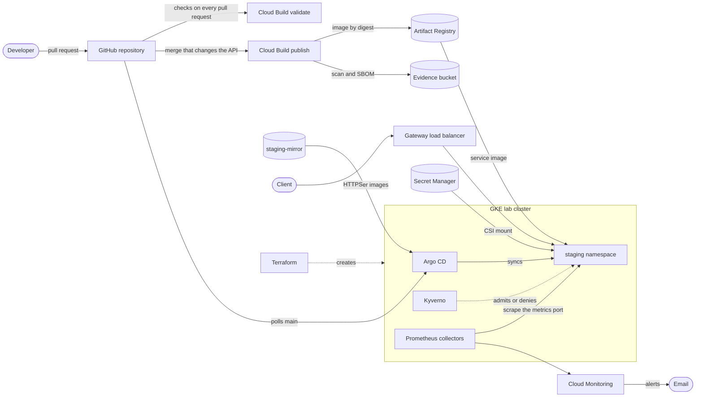

# GKE Application Platform

I built a reusable application deployment platform on GKE with Terraform, Kubernetes, Argo CD, Helm, Kyverno, Cloud Build, Docker, and Managed Service for Prometheus. A developer deploys a service through a reviewed configuration change and gets secure defaults, health checks, metrics with email alerts, and Git-based recovery. My design reference is [architecture.md](architecture.md).

It runs in my personal GCP project `gke-build-proj` as a temporary staging environment. I work to a $100 budget and remove the cluster within 24 hours of creating it. GCP resources are named `<environment>-<purpose>`, Kubernetes resources `<environment>-<service>`, and each environment has one namespace named `<environment>`; see [Project structure](architecture.md#project-structure).

## How it fits together

A release is a pull request that changes one image digest in `values-staging.yaml`. Argo CD applies it, Kyverno admits only workloads that meet the platform's rules, and a revert brings back the previous digest without a rebuild.

## Where to start

| To | Read |
| --- | --- |
| Build, run, or tear down the platform | [Runbook](RUNBOOK.md) |
| Understand how each component works, and why | [Guide](GUIDE.md) |
| Test the Python service, or build and run its image | [Applications README](apps/README.md) |
| Validate the Helm chart, or deploy it on Docker Desktop | [Platform README](platform/README.md) |
| Bootstrap GCP, apply Terraform, or run a lab session | [Infrastructure README](infra/README.md) |
| Publish an image, or choose which image staging runs | [Pipeline README](pipeline/README.md) |
| Run Argo CD, release, or roll back | [GitOps with Argo CD](platform/README.md#gitops-with-argo-cd) |
| Investigate an alert, or drain a node | [Runbook](RUNBOOK.md#operate-the-platform) |

## Reproducing it

The [runbook](RUNBOOK.md) takes you from an empty Google Cloud project to a running platform, including every step done by hand outside the code, then covers releasing, operating, and tearing it down.

## Repository layout

| Path | Contents |
| --- | --- |
| [`apps/platform-verification-api/`](apps/platform-verification-api/) | FastAPI service I use to verify deployment, health, configuration, logging, and metrics. See its [README](apps/platform-verification-api/README.md) |
| [`platform/charts/service/`](platform/charts/service/) | Shared Helm chart that deploys one HTTP service |
| [`platform/services/platform-verification-api/`](platform/services/platform-verification-api/) | Chart values for the API: `values.yaml` (shared) plus one environment file, `values-staging.yaml` or `values-local.yaml` |
| [`platform/namespaces/`](platform/namespaces/) | Local namespace manifest that enforces the Pod Security "restricted" profile |
| [`platform/tests/`](platform/tests/) | Chart validation and live-check scripts, and the admission policy fixtures |
| [`platform/argocd/`](platform/argocd/) | Argo CD install overlay, the root project and Application, and the bootstrap script |
| [`platform/kyverno/`](platform/kyverno/) | Kyverno install overlay, with images from the mirror repository |
| [`platform/cluster/`](platform/cluster/) | What Argo CD manages from Git: the `staging` namespace and its guardrails, the Gateway, the admission policies, the projects, and the Applications |
| [`platform/evidence/`](platform/evidence/) | Reports from lab sessions; see the [index](platform/evidence/README.md) |
| [`infra/`](infra/) | GCP bootstrap, Terraform root and modules, and Terraform validation |
| [`RUNBOOK.md`](RUNBOOK.md) | Setup, lab sessions, releases, operations, and teardown, with commands |
| [`GUIDE.md`](GUIDE.md) | How each component works, how it is configured, and why |
| [`architecture.md`](architecture.md) | Architecture and design decisions |
| [`pipeline/`](pipeline/) | Cloud Build configuration that tests, builds, scans, and publishes the API image. See its [README](pipeline/README.md) |

## Current status

| Build | Status |
| --- | --- |
| Architecture and design decisions | Done |
| Verification service and shared Helm chart | Done |
| GCP foundation: Terraform, GKE, Artifact Registry, IAM | Done |
| Image build pipeline: Cloud Build, recorded digests | Done |
| GitOps deployment: Argo CD from Git | Done |
| Identity, secrets, and namespace isolation | Done |
| Admission policies, chart 1.0.0, and HTTPS | Done |
| Validation suite: pull request CI and live checks | Done |
| Observability: metrics and email alerts | Done |
| Acceptance tests: load, autoscaling, Pod failure, node drain | Done; a node upgrade rehearsal is still open |
| Cost report | Planned |

What works today:

- **Service:** health routes, validated configuration, JSON logs with request IDs, Prometheus request metrics on a separate port, and graceful shutdown. Its image runs as non-root user `10001` with a read-only root filesystem and no capabilities, and passes my Trivy gate for fixable MEDIUM, HIGH, and CRITICAL vulnerabilities.
- **Chart:** deploys one HTTP service with restricted pod security, digest-only images, probes, an autoscaler, a disruption budget, optional metrics scraping, and rolling updates with zero unavailable pods. A values schema and template checks reject bad input before anything reaches a cluster. I deployed it on Docker Desktop Kubernetes into a namespace that enforces the "restricted" profile.
- **GCP:** Terraform manages the persistent resources, and a private GKE cluster, its alert policies, and its load balancer address, which I create and remove in each lab session.
- **Pipeline:** Cloud Build tests, builds, and scans the API image on every pull request. Merges that change the API publish an image tagged with its commit, with provenance, a scan report, and an SBOM; a failed check means nothing is pushed.
- **GitOps:** Argo CD deploys staging from `main`. Releasing is a pull request that changes one digest, and rolling back is a Git revert that reuses the image already in the registry. In a lab session on 2026-10-03, a release took 1 minute 37 seconds and a rollback 1 minute 57 seconds from merge to healthy, with no unavailable pods; see the [evidence report](platform/evidence/2026-10-03-gitops.md).
- **Isolation:** each service reads its own Secret Manager secrets through its own Kubernetes service account, and a rotated value reaches it without a restart. The `staging` namespace denies all network traffic except DNS, caps resources with a quota and default limits, and gives developers read-only access. In a lab session on 2026-10-06, every unauthorized secret, Google API, network, and RBAC attempt was refused, and a new secret version reached every pod in 60 seconds; see the [evidence report](platform/evidence/2026-10-06-isolation.md).
- **Admission:** Kyverno checks every workload in `staging` against seven policies: approved registry, image digest, resources, labels, service account, Pod security, and a read-only root filesystem. Violations are rejected with a message naming the field and the fix, and the platform's own controller images come from my mirror repository. In a lab session on 2026-10-07, every failing fixture was denied while the running workloads passed; see the [evidence report](platform/evidence/2026-10-07-admission.md).
- **HTTPS:** during a lab session, the API answers at `https://api.staging.gke.josephdara.com/` through a GKE Gateway with a Google-managed certificate, and only the load balancer can reach its Pods.
- **Observability:** Managed Service for Prometheus scrapes each service's metrics port, which only its collectors can reach, and labels every series with the release. Three email alerts cover a Deployment with no ready replicas, an error rate above 1%, and p95 latency above 500 ms. When the API lost its last replica, the alert email arrived 3 to 4 minutes later; see the [evidence report](platform/evidence/2026-10-07-acceptance.md).
- **Acceptance:** at 20 requests per second through the Gateway, 99.78% of requests succeeded, with a p95 of 56 ms at the client. At 150 requests per second, the autoscaler went from 2 to 3 replicas as soon as CPU passed its 70% target. A Pod failure and a node drain under load each kept success above 99%, at 99.22% and 99.56%. A node upgrade rehearsal did not replace any node, so that test is still open; see the [evidence report](platform/evidence/2026-10-07-acceptance.md).
- **Validation:** every pull request runs the app tests, the image scan, chart renders against the Kubernetes schemas, the policy fixtures, and the Terraform checks. `platform/tests/live-checks.sh` repeats the non-disruptive cluster checks in any session, and the [evidence index](platform/evidence/README.md) lists every session report.

`values-staging.yaml` points at an image the pipeline published. To choose a different one, see [Promoting an image to staging](pipeline/README.md#promoting-an-image-to-staging).

## One failed experiment

In a lab session on 2026-10-06, the API's Pods could not resolve any name. The DNS NetworkPolicy allowed only Pods labelled `k8s-app: kube-dns`, but GKE turns on NodeLocal DNSCache by default for Standard clusters on these versions, so each Pod's queries went to a cache Pod on its own node, which the policy did not match. I changed the policy to allow port 53 to any Pod in `kube-system`, and set NodeLocal DNSCache explicitly in Terraform so the dependency is visible in code. The next lab session confirmed that names resolved while outbound connections stayed blocked. See [DNS failure](platform/evidence/2026-10-06-isolation.md#dns-failure).

## Limitations

- **Load balancer 503s:** about 1 request in 1,000 got a 503 from the load balancer even when no Pod changed, and the API never saw them. Load balancer request logging is off, so the cause is not confirmed; the likely fix is an API keep-alive longer than the load balancer's 600 seconds.
- **Disruptions drop requests:** a Pod failure and a node drain each cost about 50 requests. A `preStop` delay or connection draining on the backend should close the gap.
- **No spreading rule:** both replicas can run on one node, as they did after the drain.
- **No spare node:** two nodes cannot absorb the loss of one; the autoscaler adds a third within about a minute.
- **Node upgrades not rehearsed:** the nodes already ran the control plane's version, so the upgrade command replaced nothing.
- **Alerts see only the API's metrics:** errors the load balancer returns by itself never reach the error-rate alert. Alert emails say `on __missing__` where a resource name would appear.
- **One environment in one zone:** a zonal staging cluster that exists only during lab sessions.
- **Developer access:** tested by impersonation only; Google Groups for RBAC is not configured.
- **Left out:** a second service and an onboarding rehearsal, custom dashboards, Terraform CI with a deployment identity, policy exception tooling, consistency checks across rendered resources, and a recorded format for Trivy exceptions.

## Tool versions

I built and tested the current state with these versions. The Terraform and Google Cloud versions are in the [Infrastructure README](infra/README.md#tool-versions).

| Tool | Version |
| --- | --- |
| Python | 3.14.8 (image and CI) |
| Helm | 4.2.1 (the version bundled with Argo CD) |
| Argo CD | 3.5.3 (core install) |
| kubectl | 1.37.0 |
| Docker | 29.8.0 |
| Trivy | 0.74.0 |
| kubeconform | 0.8.0 |
| Kyverno CLI | 1.19.1 |
| oha | 1.16.0 (load tests) |
